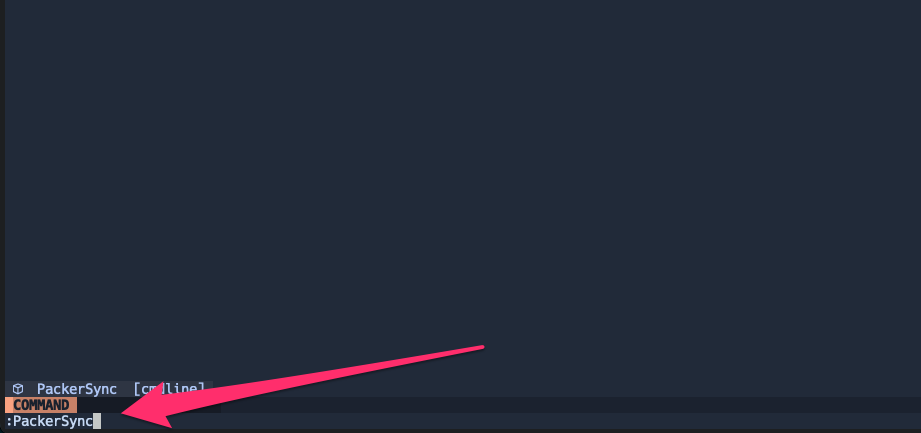
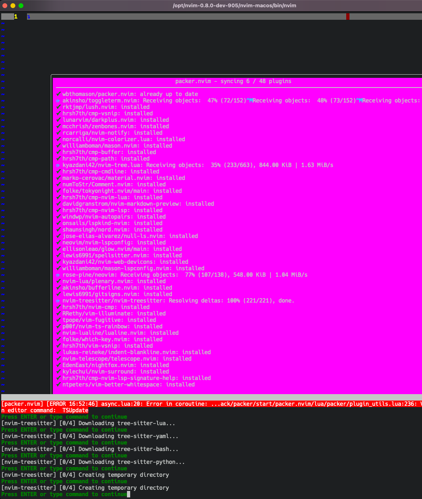

# neovim-dotfiles

Dotfiles for Neovim used by Mengano.Net

## Installation

#### Clear previous configuration

If you have existing Neovim configuration you must first get rid of it.\
Clear/backup the following directories:

- `~/.config/nvim/`
- `~/.cache/nvim/`
- `~/.local/share/nvim/`

#### Requirements

- neovim >= 0.9.0
- For Unix systems: git, curl or wget, unzip, tar, gzip, node, npm.
- Get a release version [i.e. v
  1.3.0](https://github.com/mengano-net/neovim-dotfiles/releases/tag/1.3.0)
- Copy all contents into your `~/.config/nvim/`

## Starting Neovim

- The first time you launch, Neovim will dump errors, primarily due to not having `Packer`
  installed. Packer is a plug-in that manages all other plugins. Just give it 1 minute for
  Neovim to install Packer, then quit/re-launch Neovim.
- The first thing is to run Packer to install all necessary plugins: you do it by
  running `PackerSync` Neovim command as shown:\
  
- Once packer completes its first run and installs all plugins, you will a pop up window
  confirming installation. At the bottom you will see information from nvim-tresitter on languages
  supported. \
  
- Next run `PackerCompile` command.
- Quit and relaunch Neovim and you should be in business.

## How to use

- First you need to know some basics of vim operations that I'm not covering here.
- One of the plugins in use, manages key maps(key combinations performing some actions). _Most_ key
  combinations need a `leader` key to start them, in my case, it's `space` key, so press it and see
  window that comes up at the bottom for hints.
